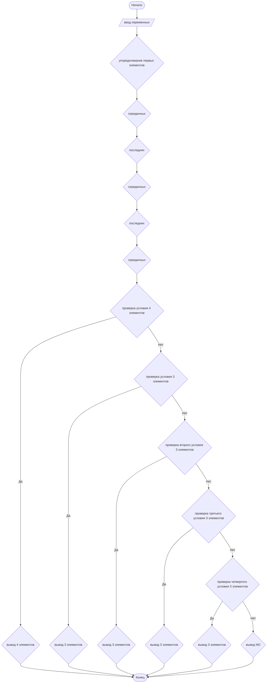

## Отчет по лабораторной работе № 1

#### № группы: `ПМ-2402`

#### Выполнил: `Хлестов Егор Андреевич`

#### Вариант: `28`

### Cодержание:

- [Постановка задачи](#1-постановка-задачи)
- [Входные и выходные данные](#2-входные-и-выходные-данные)
- [Выбор структуры данных](#3-выбор-структуры-данных)
- [Алгоритм](#4-алгоритм)
- [Программа](#5-программа)
- [Анализ правильности решения](#6-анализ-правильности-решения)

### 1. Постановка задачи

> Программа получает на вход 4 натуральных числа A, B, C и D. Требуется проверить, образуют ли хотя
бы 3 из них арифметическую прогрессию, и если да, то вывести прогрессии
по возрастанию.


Данную задачу можно разделить на 2 подзадачи: сортировка элементов для удобного нахождения прогрессии и проверка достаточных условий.

- Для 1 подзадачи целесообразно будет использование целочисленного типа данных.
- Для 2 подзадачи я выделил 4 варианта:
    1. `Все 4 числа образуют прогрессию.`
    2. `Прогрессию образуют 3 числа, идущих по порядку.` (2 варианта)  
    p - число, входящее в прогрессию. x - не входящее.
    - `[p, p, p, x] `
    - `[x, p, p, p]`
    3. `Прогрессию образуют 3 "разбитых" числа.`
    - `[p, x, p, p]`
    - `[p, p, x, p]`
    4. `Отсутствие прогрессии`

Всего необходимо рассмотреть `6` случаев.

### 2. Входные и выходные данные
На вход программа должна получать 4 натуральных числа, а следовательно целых. Верхняя граница получаемых
чисел не дана, нижняя - 1. Так как данные в процессе не преобразуются, а лишь анализируются, то данные на выход будут такими же. Единственное замечание - это то, что на выход могут быть поданы лишь 3 числа из 4 либо "NO"(тип String).

|             | Тип         | min значение | max значение |
|-------------|-------------|----------|--------------|
| A (Число 1) | Целое число |       1  | MaxInt       |
| B (Число 2) | Целое число |       1  | MaxInt       |
| C (Число 3) | Целое число |       1  | MaxInt       |
| D (Число 4) | Целое число |       1  | MaxInt       |
### 3. Выбор структуры данных

Программа получает 4 натуральных числа, структура данных int.

|            | название переменной | Тип (в Java) | 
|------------|---------------------|--------------|
| A,B,C,D, t | `a`                 | `int`        |

### 4. Алгоритм

#### Алгоритм выполнения программы:

1. **Ввод данных:**  
   Программа считывает 4 числа и создает переменную t.

2. **Сортировка чисел:**  
   С помощью переменной t происходит упорядочивание чисел по возрастанию.

3. **Проверка существования прогрессии (для каждого случая), основанная на разности прогрессии:**
    - `d(1) = p(2) - p(1)`  `d(n) = p(n) - p(n-1)`

4. **Вывод результата:**  
   На экран выводится соответствующие значения в зависимости от условия. (p p p p или p p p или NO)

#### Блок-схема



### 5. Программа

```java
import java.io.PrintStream;
import java.util.Scanner;
public class Main {
    public static Scanner in = new Scanner(System.in);
    public static PrintStream out = System.out;
    public static void main(String[] args) {
        Scanner scan = new Scanner(System.in);
        int a = scan.nextInt();
        int b = scan.nextInt();
        int c = scan.nextInt();
        int d = scan.nextInt();
        int t;
        if(a>b){
            t = a;
            a = b;
            b = t;
        }if(b>c){
            t = b;
            b=c;
            c=t;
        }if(c>d){
            t=c;
            c=d;
            d=t;
        }if(b>c){
            t = b;
            b=c;
            c=t;
        }if(a>b){
            t = a;
            a = b;
            b = t;
        }if(b>c){
            t = b;
            b=c;
            c=t;
        }if(d-c==c-b&&c-b==b-a){ // проверка условия, когда 4 числа создают арифметическую прогрессию и вывод 4 чисел.
            out.printf("%d %d %d %d",a,b,c,d);
        }else if(c-b==b-a){
            out.printf("%d %d %d",a,b,c);
        }else if(d-c==c-b){
            out.printf("%d %d %d",b,c,d);
        }else if(d-b==b-a){
            out.printf("%d %d %d",a,b,d);
        }else if(d-c==c-a){
            out.printf("%d %d %d",a,c,d);// проверка всех возможных случаев расположения трех элементов среди четырех мест и вывод соответствующих последовательностей
        }else{
            out.print("NO"); // вывод, если среди вводных данных не содержится прогрессия
        }
    }
}

```

### 6. Анализ правильности решения

Программа работает корректно на всем множестве решений с учетом ограничений.

1. Тест на `p<p<p<p`:

    - **Input**:
        ```
        11 9 5 7
        ```

    - **Output**:
        ```
        5 7 9 11
        ```

2. Тест на `p<p<p<x`:

    - **Input**:
        ```
        6 765 26 46
        ```

    - **Output**:
        ```
        6 26 46
        ```

3. Тест на `x<p<p<p`:

    - **Input**:
        ```
        16 4 3 10
        ```

    - **Output**:
        ```
        4 10 16
        ```

4. Тест на `p<x<p<p`:

    - **Input**:
        ```
        10 15 9 5
        ```

    - **Output**:
        ```
        5 10 15
        ```

5. Тест на `p<p<x<p``:

    - **Input**:
        ```
        60 54 36 12
        ```

    - **Output**:
        ```
        12 36 60
        ```
6. Тест на вывод "NO""`:

    - **Input**:
        ```
        2 4 5 7
        ```

    - **Output**:
        ```
        NO
        ```